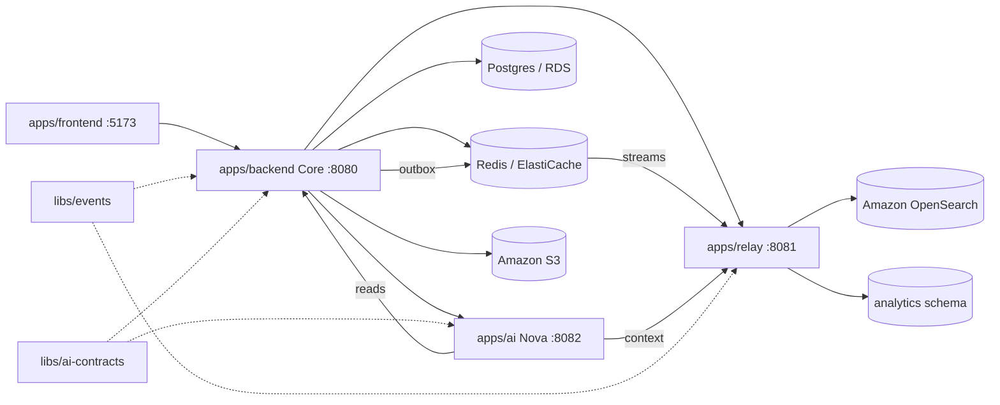

# 00 — Product & Architecture Overview

## What TaskMind is

TaskMind is an **AI-centered task manager**. Beyond CRUD task management it provides:

- **AI capture** — turn free-form text into structured task drafts.
- **Goal breakdown** — decompose a goal into milestones + sibling tasks.
- **Auto-scheduler** — Motion-style time-aware scheduling of tasks into calendar blocks.
- **Spec breakdown** — turn a product spec into an Epic → Story → Subtask hierarchy.
- **Weekly review & dashboard insights** — AI narratives over real activity.
- **Nova chat** — conversational assistant with tool access (read tasks, capture, etc.).
- **Integrations** — Jira Cloud + GitHub (import/publish), wiki connect.
- **Notifications** — in-app + SSE + email digest + Slack + reminders.
- **Analytics / reports** — throughput, workload, KPIs from a projection pipeline.

See [`reference/ai-capabilities.md`](reference/ai-capabilities.md) for the authoritative AI capability catalog used by the Nova, Core facade, Relay context, and frontend AI milestones.

The product is delivered as **one Vue SPA + three Spring Boot services + two shared Java libraries**.

## Components

| Path | Type | Role | Port |
|------|------|------|------|
| `apps/frontend` | Vue 3 SPA | UI — talks **only** to Core API | 5173 |
| `apps/backend` | Spring Boot | **Core API** — system of record, auth, BFF/facades to Nova | 8080 |
| `apps/relay` | Spring Boot | Analytics projections + read/context APIs (OpenSearch) | 8081 |
| `apps/ai` | Spring Boot | **Nova** — LLM orchestration (Spring AI) | 8082 |
| `libs/events` | Java lib | Domain event envelope (Core ↔ Relay) | — |
| `libs/ai-contracts` | Java lib | AI request/response DTOs (Core ↔ Nova) | — |

## Target architecture (rebuilt, AWS data plane)

### Data flow in words

1. The **frontend** authenticates against Core and makes all calls to Core only.
2. **Core** is the system of record (Postgres). On every state change it writes a **domain event to an outbox table in the same transaction**.
3. An **outbox poller** publishes events to a **Redis Stream** (`taskmind.events`); see [`reference/domain-events.md`](reference/domain-events.md) for the envelope, catalog, and pipeline.
4. **Relay** consumes the stream (consumer group `relay-workers`), deduplicates by `eventId`, and runs **projection handlers** into the Postgres `analytics` schema and into **Amazon OpenSearch** for activity search.
5. Core facades (`/v1/ai/**`, `/v1/nova/**`) call **Nova** over service-token HTTP for any LLM work. Nova fetches real-time facts from Core (`/internal/**`) and aggregated **context** from Relay (`/internal/context/**`).
6. **Object storage** (task attachments) goes to **Amazon S3** via an `ObjectStoragePort` adapter.

## Service boundaries

> Read this before any cross-service change. Ownership is strict.

| Concern | Owner |
|---------|-------|
| Users, auth, RBAC, sessions, OTP, OAuth | **Core** |
| Tasks, projects, hierarchy, links, releases | **Core** |
| Scheduler (blocks, prefs, auto-schedule, reschedule) | **Core** |
| Comments, attachments, notifications | **Core** |
| Integrations (Jira/GitHub/wiki) | **Core** |
| Outbox + domain-event publishing | **Core** |
| AI **facades** (BFF endpoints the FE calls) | **Core** (delegates to Nova) |
| Analytics projections (daily user/project metrics, funnel) | **Relay** |
| Weekly-review / dashboard / project-health **context** for Nova | **Relay** |
| Activity search index | **Relay** → OpenSearch |
| LLM prompts, provider calls, `ai_runs` audit | **Nova** |
| Chat sessions (Redis), agent runtime, capabilities | **Nova** |

Rules of thumb:

- The **frontend never calls Relay or Nova directly** — Core exposes facade endpoints.
- **Nova never owns task/project state** — it reads facts via service tokens.
- **Relay never writes business state** — it only projects events into read models.

## Inter-service auth

- **Frontend → Core**: JWT bearer (per-user).
- **Core → Nova**, **Nova → Core/Relay**: shared **service tokens** via `X-Service-Token` header on `/internal/**` routes (`TASKMIND_*_SERVICE_TOKEN`).

## Environments

| Concern | Local dev | AWS production |
|---------|-----------|----------------|
| Postgres | container `postgres:16` | RDS PostgreSQL 16 (Multi-AZ) |
| Redis | container `redis:7` | ElastiCache Redis 7 |
| Search | container OpenSearch/ES | Amazon OpenSearch Service |
| Object storage | LocalStack S3 or filesystem fallback | Amazon S3 + IAM task role |
| Edge | nginx gateway | ALB + WAF (+ optional nginx sidecar for SSE) |
| Compute | `spring-boot:run` / compose | ECS Fargate (3 services) |
| Frontend | Vite dev server | S3 + CloudFront |
| Secrets | `infra/env/.env` | AWS Secrets Manager |

The single Postgres database `taskmind` hosts three schemas: **public** (Core), **analytics** (Relay projections), **ai** (Nova). Only **Core** and **Nova** run Flyway.

See [`reference/aws-infrastructure.md`](reference/aws-infrastructure.md) for the full AWS target and the local↔AWS mapping.

## How an agent should use this kit

1. Read [`AGENTS.md`](../../AGENTS.md) → this overview → [`conventions.md`](conventions.md).
2. Follow [`01-build-order.md`](01-build-order.md): execute milestones **M00 → M13 in order**. Each milestone has a self-contained spec in [`phases/`](phases/).
3. Consult [`reference/`](reference/) for the data model, API contract, [domain event catalog](reference/domain-events.md), AI capability catalog, and AWS infra whenever a milestone references them.
4. Gate every milestone with `make vibe-verify` (+ browser E2E for UI).
