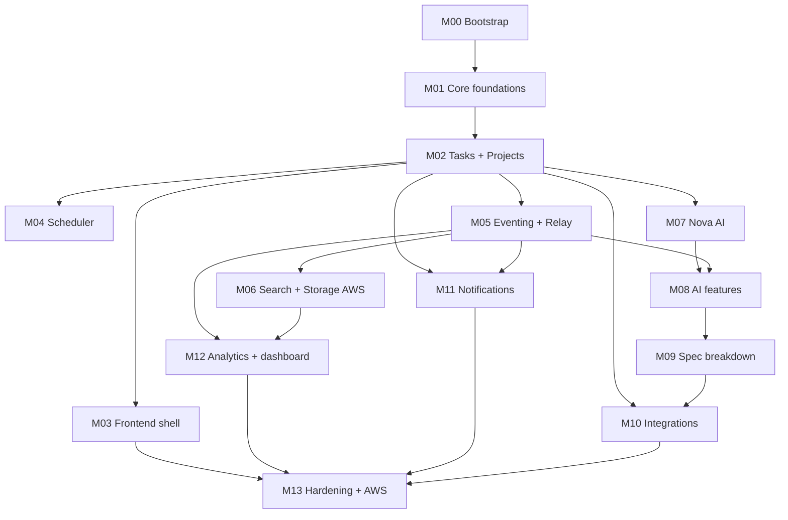

# 01 - Build Order (Milestone Roadmap)

Execute milestones **in order**. Each milestone is independently buildable and verifiable;
do not start the next until the current one passes `make vibe-verify` (and browser E2E for
UI work). Each `MXX` links to a self-contained spec under [`phases/`](phases/).

## Milestone map

| # | Milestone | Touches | Outcome |
|---|-----------|---------|---------|
| M00 | [Bootstrap](phases/M00-bootstrap.md) | repo, libs, all apps | Empty-but-running monorepo: reactor builds, 3 services boot, Vue app serves, CI gate green |
| M01 | [Core foundations](phases/M01-core-foundations.md) | Core | Persistence (Flyway V1-V5 equiv), JWT security, E2E bypass, health, global error handling |
| M02 | [Tasks + Projects](phases/M02-tasks-projects.md) | Core | Reference DDD modules (task, project) + OpenAPI contract |
| M03 | [Frontend shell](phases/M03-frontend-shell.md) | Frontend | apiClient, router guards, auth store/pages, tasks & projects pages |
| M04 | [Scheduler](phases/M04-scheduler.md) | Core, FE | Scheduling prefs, blocks, auto-scheduler, reschedule proposals, calendar UI |
| M05 | [Eventing + Relay](phases/M05-eventing-relay.md) | Core, Relay, libs/events | Outbox -> Redis Streams -> Relay projections; analytics schema |
| M06 | [Search + Storage on AWS](phases/M06-search-storage-aws.md) | Relay, Core | Activity search + OpenSearch; attachments -> S3 |
| M07 | [Nova AI](phases/M07-nova-ai.md) | Nova, Core, libs/ai-contracts | Provider router, capability pattern, agent runtime, chat, audit; Core AI facades |
| M08 | [AI features](phases/M08-ai-features.md) | Core, Nova, FE | Capture, goal breakdown, weekly review, project brief, describe/translate, insights |
| M09 | [Spec breakdown](phases/M09-spec-breakdown.md) | Core, Nova, FE | ASYNC spec -> task pipeline, templates, attachments, Jira publish |
| M10 | [Integrations](phases/M10-integrations.md) | Core, FE | Jira Cloud + GitHub + wiki connect/import/publish |
| M11 | [Notifications](phases/M11-notifications.md) | Core, FE | In-app + SSE + email digest + Slack + reminders |
| M12 | [Analytics + dashboard](phases/M12-analytics-dashboard.md) | Core, Relay, FE | Reports/throughput, dashboard aggregation, team directory |
| M13 | [Hardening + AWS deploy](phases/M13-hardening-aws-deploy.md) | all | Rate limiting, observability, prod profile, ECS/RDS/ElastiCache/OpenSearch/S3 |

## Dependency graph

## Verification gates (apply to every milestone)

1. **Compile** - `make build` (or targeted `mvn -q -pl apps/<svc> -am test`).
2. **Quality gate** - `make vibe-verify` (Java tests + FE typecheck within timeouts).
3. **UI proof** (M03+ UI milestones) - browser E2E on `localhost:5173` using the
   superadmin bypass (`superadmin@taskmind.local` / `1` / OTP `1`). See
   [`reference/api-contract.md`](reference/api-contract.md) for the endpoints exercised.
4. **Contract sync** - if Core request/response shape changed, update
   `apps/backend/openapi.yaml` in the same milestone.

## Sequencing notes

- **M00-M03 are the critical path** to a usable vertical slice (auth + tasks + projects in
  the browser). Get these rock-solid before fanning out.
- **M05 (eventing)** unlocks Relay, analytics, and activity-driven AI context. Build the
  `libs/events` envelope first, then the outbox, then the Relay consumer.
- **M07 (Nova)** can be built in parallel with M04/M05 conceptually, but the spec assumes
  M02 contracts exist. Build Nova with the **mock provider** first so everything is
  deterministic; wire real providers (OpenAI/Anthropic/NAMC) last.
- **M13** is cross-cutting hardening + the AWS deployment story; do it once features are
  parity-complete.

## Parity checklist (track as you go)

Core feature modules to reach parity: `task`, `project`, `auth`, `scheduler`, `dashboard`,
`analytics`, `activity`, `ai`, `outbox`, `events`, `internal`, `integration`,
`specbreakdown`, `attachment`, `comment`, `notification`, `team`, `ratelimit`, `security`,
`config`, `common`.

Frontend features: `auth`, `tasks`, `projects`, `scheduler`, `team`, `reports`, `ai`,
`specbreakdown`, `integrations`, `notifications`, `landing`.

Services: Core (`apps/backend`), Relay (`apps/relay`), Nova (`apps/ai`). Libs:
`libs/events`, `libs/ai-contracts`.

Each milestone below maps to a subset; M13 verifies the full set is present.
