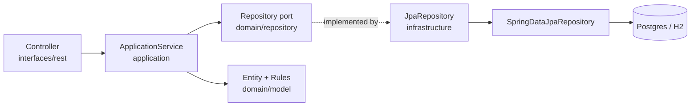
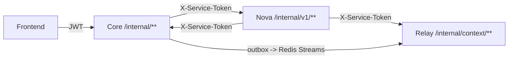

# Reference — Backend Services (Core / Relay / Nova)

All three Spring Boot services share **Java 17 + Spring Boot 3.3.5**, the **DDD four-layer feature-module** layout, Flyway-owned schemas, and the `X-Service-Token` internal contract. This doc is the backend counterpart to [`frontend.md`](frontend.md). It focuses on **Core** (`apps/backend`, the only public backend service) and points to the dedicated references for the data plane, events, AI, and AWS.

- API surface → [`api-contract.md`](api-contract.md)
- Schema / migrations → [`data-model.md`](data-model.md)
- Core → Relay events → [`domain-events.md`](domain-events.md)
- Nova / LLM → [`ai-capabilities.md`](ai-capabilities.md)
- Deploy / data plane → [`aws-infrastructure.md`](aws-infrastructure.md)
- Patterns you must follow → [`../conventions.md`](../conventions.md)

## Service map

| Service | Module | Port | Public | Owns |
|---------|--------|------|--------|------|
| **Core** | `apps/backend` | 8080 | yes | system of record, auth, all FE-facing APIs, AI/Nova facades, outbox |
| **Relay** | `apps/relay` | 8081 | no | event projections, analytics rollups, OpenSearch indexing, Nova context |
| **Nova** | `apps/ai` | 8082 | no | LLM orchestration, capabilities, chat, `ai_runs` audit |
| `libs/events` | shared jar | — | — | `DomainEvent` envelope + `EventTypes` for Core → Relay |
| `libs/ai-contracts` | shared jar | — | — | Core ↔ Nova request/response records + JSON schemas |

Build order in the Maven reactor: `libs/events` → `libs/ai-contracts` → `apps/backend` → `apps/relay` → `apps/ai`. The frontend is **not** in the reactor.

## Core feature modules (`com.taskmind.backend.<module>`)

Each feature is an independent vertical slice. The `task` module is the **reference example**; mirror its shape everywhere.

| Module | Responsibility | Notable pieces |
|--------|----------------|----------------|
| `task` | Tasks, hierarchy, links, types, releases | `TaskController`, `TaskApplicationService`, `TaskHierarchyRules`, `TaskTypeRules` |
| `project` | Projects, memberships, AI brief facade | `ProjectController`, `ProjectBriefController` |
| `auth` | Users, RBAC, sessions, OTP, OAuth, JWT issue/refresh | `OtpService`, `JwtTokenService`, identity tables |
| `scheduler` | Preferences, blocks, auto-schedule, reschedule proposals | `RescheduleProposalEngine`, `RescheduleProposalService` |
| `comment` | Task comments + reactions | `CommentAuthorResolver` |
| `attachment` | Task attachments through `ObjectStoragePort` | upload/list/download/delete |
| `notification` | In-app + SSE + email digest + Slack + reminders | `NotificationDigestJob`, `NotificationSlackDispatcher` |
| `integration` | Jira Cloud + GitHub + wiki connect/import/publish | `JiraRestClient`, `GitHubRestClient`, OAuth state |
| `specbreakdown` | Async spec → Epic/Story/Subtask jobs + templates | `SpecHierarchyValidator`, `SpecBreakdownProcessingCheckpoint` |
| `ai` | BFF facades to Nova (`/v1/ai/**`, `/v1/nova/**`) | `NovaAiClient`, `AiFacadeApplicationService`, local fallbacks |
| `dashboard` | Aggregated home (`/v1/dashboard`) | read aggregation |
| `analytics` | `/v1/reports` over Relay rollups | `AnalyticsRollupRepository` |
| `activity` | Activity log + `/v1/activity/search` | `ActivitySearchController` using OpenSearch |
| `team` | `/v1/team/directory` aggregation | team directory aggregation |
| `outbox` | Transactional outbox + Redis Streams publish | `RedisStreamEventTransport`, poller |
| `events` | Core-side event publishers wrapping `libs/events` | `task/project` publishers |
| `internal` | Service-token read APIs for Nova | `InternalTaskReadController` |
| `ratelimit` | Bucket4j Redis per-user and AI quotas | `RateLimitFilter` |

Cross-cutting packages are not feature slices:

| Package | Holds |
|---------|-------|
| `config` | `WebClientConfig`, `WebCorsConfig`, `SchedulingConfig`, `ShedLockConfig`, OpenSearch autoconfig exclusions |
| `security` | `SecurityConfig`, `ApiSecurityAuthorization`, `JwtClaimAuthenticationConverter`, `AuthenticatedUserResolver` |
| `common` | `web` logging/error helpers, `email`, `slack`, `content`, shared domain helpers |

## Four-layer anatomy (per module)

```text
<module>/
  interfaces/rest/                 thin controllers: validate, map DTO, delegate
  interfaces/rest/dto/             Create*Request / Update*Request / *Response records
  application/                     *ApplicationService (@Transactional), Create*/Update*Command
  domain/model/                    self-validating entities + enums
  domain/                          *Rules domain services
  domain/repository/               repository ports (interfaces)
  infrastructure/persistence/jpa/  *JpaEntity + *JpaRepository adapter + SpringDataJpaRepository
```



Hard rules from [`../conventions.md`](../conventions.md):

- Controllers hold **no** business logic; application services **own transactions** and depend on **domain ports**, never on Spring Data directly.
- Domain entities are self-validating; persistence lives in `*JpaEntity` mappers.
- Every mutable entity has an optimistic-lock `@Version`; stale writes reject with `409 Conflict`.
- Soft-delete via `deleted_at` where the reference uses it.

## Security (Core)

Core is a stateless **JWT resource server**. Errors use RFC 7807 `ProblemDetail`.

- `SecurityConfig` + `ApiSecurityAuthorization` define route rules.
- **Public:** `/api/health`, `/v1/auth/login`, `/v1/auth/signup/**`, `/v1/auth/verify/**`, `/v1/auth/oauth/**`, `/v1/auth/password/**`, `/v1/auth/token/refresh`, `/v1/auth/logout`, and integration OAuth callbacks.
- **Authenticated:** everything else under `/v1/**`.
- **Denied:** all other routes.
- `/internal/**` is a separate `@Order(0)` chain requiring `X-Service-Token`.
- JWT claims become authorities via `JwtClaimAuthenticationConverter`; `AuthenticatedUserResolver` exposes the current user to controllers.
- **E2E bypass** (`taskmind.auth.e2e-bypass.*`) seeds the super-admin (`superadmin@taskmind.local` / password `1` / OTP `1`), is enabled in `local`, `test`, and isolated browser E2E runs that activate the dedicated `e2e` profile; generic `staging` keeps it disabled and startup fails if the bypass is forced on without `local`, `test`, or `e2e`.

## Persistence

- **Flyway owns the schema**; `spring.jpa.hibernate.ddl-auto=validate`.
- Migrations live under `apps/<service>/src/main/resources/db/migration/` as `V<n>__description.sql`.
- Migrations are **append-only**: add the next integer and never edit an applied migration.
- One database, `taskmind`, hosts three schemas: **public** for Core, **analytics** for Relay projections, and **ai** for Nova.
- Only Core and Nova run Flyway.
- Distributed scheduled-job locks use **ShedLock** (`shedlock` table, `ShedLockConfig`).

## Inter-service communication



- Frontend → Core only, using a per-user JWT bearer token.
- Core ↔ Nova ↔ Relay use shared service tokens (`TASKMIND_*_SERVICE_TOKEN`) on `/internal/**`; WebClient wiring lives in `config/WebClientConfig`.
- Core → Relay is **event-driven** through the transactional outbox and Redis Stream `taskmind.events`; see [`domain-events.md`](domain-events.md).

## Configuration & profiles

| Profile | Use |
|---------|-----|
| `local` | dev against compose infra; E2E bypass on |
| `test` | H2 in PostgreSQL mode; Flyway runs; OpenSearch/ES autoconfig excluded; bypass on |
| `staging` | pre-prod; bypass off by default |
| `e2e` | isolated browser E2E opt-in layered onto non-prod environments; bypass on |
| `prod` | requires `TASKMIND_JWT_SECRET`; bypass must be off (enforced) |

Key environment and property families: `TASKMIND_JWT_SECRET`, `TASKMIND_*_SERVICE_TOKEN`, `TASKMIND_STORAGE_*` for S3, `spring.elasticsearch.uris` for OpenSearch, `TASKMIND_AI_*` for Nova provider routing, `taskmind.outbox.*`, `taskmind.relay.*`, and `taskmind.ratelimit.*`.

## Testing

- Use TDD: **RED → GREEN → REFACTOR**.
- Tests run under the `test` profile on **H2 in PostgreSQL mode**. Flyway still runs, so a broken migration breaks the build.
- Aim per module for a controller-slice test (request → response + status), an application-service test (orchestration + conflict/error paths), and domain-rule unit tests.

```bash
mvn -q test                                  # all tests in module
mvn -q -Dtest='*Task*' test                  # pattern
mvn -q -Dtest=TaskControllerTest#name test   # single method
make vibe-verify                             # gate: Java tests + FE typecheck with timeouts
```

## Rebuild guidance

1. **M00** bootstrap: reactor + `libs/events` + `libs/ai-contracts` skeletons; all three services boot with `/api/health` for Core and actuator health for Relay/Nova.
2. **M01** Core foundations: persistence (Flyway V1-V5 equivalent), JWT security + E2E bypass, global `ProblemDetail` error handling.
3. **M02** build `task`, then `project` as the canonical four-layer modules; keep `openapi.yaml` in sync.
4. Add modules milestone by milestone: scheduler → eventing/Relay → search/storage → Nova → AI features → spec breakdown → integrations → notifications → analytics. Each module should mirror the `task` module shape and be gated by `make vibe-verify`.
