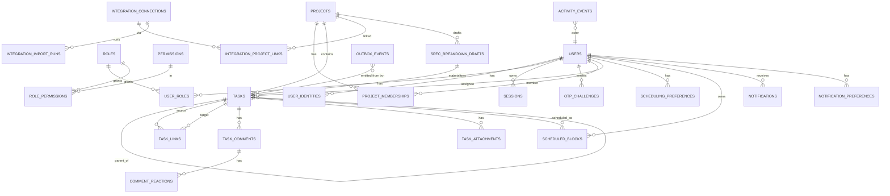

# Reference - Data Model

This document is the target data-model reference for the TaskMind rebuild. It complements
[`AGENTS.md`](../../../AGENTS.md), the architecture overview in
[`00-overview.md`](../00-overview.md), and the milestone sequencing in
[`01-build-order.md`](../01-build-order.md).

The schema is owned by **Flyway**. Hibernate must validate the schema rather than create
or mutate it at runtime (`spring.jpa.hibernate.ddl-auto=validate`). Implement migrations
as ordered `V<n>__*.sql` files under the owning service's `src/main/resources/db/migration/`
directory.

For the rebuild, early reference migrations may be consolidated when a milestone asks for
an equivalent schema, but the resulting schema must stay equivalent to the reference
contract. Once a migration has been applied, migrations are append-only: add the next
integer and do not edit an applied migration.

## Schema ownership and service boundaries

The `taskmind` Postgres database is shared by service-owned schemas:

| Schema | Owning service | Purpose | Flyway owner |
|--------|----------------|---------|--------------|
| `public` | Core (`apps/backend`) | System-of-record business data: auth, tasks, projects, scheduler, comments, attachments, integrations, notifications, activity, and transactional outbox. | Core |
| `analytics` | Relay (`apps/relay`) | Projection/read-model tables fed from Core events. Relay owns projection logic and never writes Core business state. | Core creates the schema/tables in the reference history; Relay owns the projections at runtime. |
| `ai` | Nova (`apps/ai`) | Nova audit data such as `ai_runs`. Nova does not own task or project state. | Nova |

These boundaries match the build-kit service rules: the frontend calls only Core, Core is
the system of record, Relay projects read models, and Nova owns LLM orchestration/audit.

## Migration history reference

This table records the reference migration history for Core public tables plus the Relay
`analytics` schema. Use it as a parity checklist while implementing milestones; do not
interpret it as permission to skip the milestone specs.

| File | Creates / changes |
|------|-------------------|
| `V1__create_tasks_table.sql` | `tasks` plus task indexes. |
| `V2__create_projects_table.sql` | `projects`. |
| `V3__create_project_memberships_table.sql` | `project_memberships`. |
| `V4__add_optimistic_lock_version_columns.sql` | Adds `version` columns to `tasks` and `projects`. |
| `V5__create_authn_authz_tables.sql` | `users`, `user_identities`, `roles`, `permissions`, `user_roles`, `role_permissions`, `sessions`, `otp_challenges`; renames `projects.key` to `project_key`. |
| `V6__create_scheduler_tables.sql` | `scheduling_preferences`, `scheduled_blocks`. |
| `V7__add_user_display_name_and_seed_roles.sql` | `users.display_name`; seed `MEMBER` role. |
| `V8__seed_rbac_permissions.sql` | Seed `MANAGER` and `ADMIN` roles plus permissions. |
| `V9__replace_energy_with_story_points.sql` | Drop task energy/duration fields, add `story_points`, and trim scheduler energy windows. |
| `V10__add_soft_delete_columns.sql` | `deleted_at` on `projects`, `tasks`, memberships, and `scheduled_blocks`. |
| `V11__add_task_key_column.sql` | `tasks.task_key` with backfill and unique indexes. |
| `V12__create_activity_events_table.sql` | `activity_events`. |
| `V13__create_outbox_events_table.sql` | `outbox_events`. |
| `V14__create_analytics_schema.sql` | `analytics` schema tables including `event_store`, `daily_user_metrics`, and `daily_project_metrics`. |
| `V15__add_task_assignee_id.sql` | `tasks.assignee_id` foreign key to `users`. |
| `V16__create_task_comments_tables.sql` | `task_comments`, `comment_reactions`. |
| `V17__add_scheduled_block_rationale.sql` | `scheduled_blocks.rationale`. |
| `V18__create_notifications_tables.sql` | `notifications`, `notification_preferences`. |
| `V19__add_slack_notification_preferences.sql` | Slack preference columns on `notification_preferences`. |
| `V20__create_integrations_tables.sql` | `integration_connections`, `integration_oauth_states`, `integration_project_links`, `integration_import_runs`, `integration_external_links`. |
| `V21__create_task_attachments_table.sql` | `task_attachments`. |
| `V22__create_shedlock_table.sql` | `shedlock` distributed job-lock table. |
| `V23__add_project_accent_color.sql` | `projects.accent_color`. |
| `V24__create_spec_breakdown_drafts_table.sql` | `spec_breakdown_drafts`. |
| `V25__add_task_hierarchy.sql` | `parent_task_id` and `task_level` on `tasks`. |
| `V26__spec_breakdown_async_jobs.sql` | Job-tracking columns on `spec_breakdown_drafts`. |
| `V27__spec_breakdown_workspace.sql` | Rich content, templates, and spec-breakdown attachment tables. |
| `V28__task_scrum_jira_fields.sql` | `spec_breakdown_draft_id`, `fix_version`, `affected_version`, and sprint fields. |
| `V29__integration_project_link_metadata.sql` | `metadata_json` on project links. |
| `V30__spec_breakdown_pause_cancel.sql` | Pause, cancel, and checkpoint columns for spec-breakdown jobs. |
| `V31__spec_breakdown_ai_job_type.sql` | `ai_job_type` column. |
| `V32__task_type_links_and_release_index.sql` | `task_type`, `task_links` table, and release-oriented index. |

Nova owns a separate `ai` schema through its own migration set, starting with
`apps/ai/src/main/resources/db/migration/V1__create_ai_schema.sql`, which creates the
`ai_runs` audit table.

## Core entity relationships (ERD)

## Key tables

| Table | Purpose | Owning module |
|-------|---------|---------------|
| `tasks` | Task entity: title, status, type, hierarchy (`parent_task_id`), `task_level`, `task_key`, `assignee_id`, story points, sprint/version fields, optimistic-lock `version`, and `deleted_at`. | `task` |
| `task_links` | Cross-task links such as blocks, relates, and duplicates. | `task` |
| `projects` | Project entity: `project_key`, name, `accent_color`, optimistic-lock `version`, and `deleted_at`. | `project` |
| `project_memberships` | User-to-project membership with project role. | `project` |
| `users`, `user_identities` | Accounts and external identities such as Google identities. | `auth` |
| `roles`, `permissions`, `user_roles`, `role_permissions` | RBAC roles, permissions, and assignments. | `auth` |
| `sessions` | Hashed refresh-token sessions. | `auth` |
| `otp_challenges` | Email/SMS OTP challenges. | `auth` |
| `scheduling_preferences` | Per-user scheduling windows and preferences. | `scheduler` |
| `scheduled_blocks` | Calendar blocks for tasks, including scheduler rationale. | `scheduler` |
| `task_comments`, `comment_reactions` | Task comments and emoji reactions. | `comment` |
| `task_attachments` | File attachment metadata, including S3 object key and media kind. | `attachment` |
| `notifications`, `notification_preferences` | In-app notifications and notification preferences, including Slack preferences. | `notification` |
| `integration_connections`, `integration_oauth_states`, `integration_project_links`, `integration_import_runs`, `integration_external_links` | Jira/GitHub integration connection state, OAuth state, project links, import runs, and external links. | `integration` |
| `spec_breakdown_drafts` plus spec-breakdown templates and attachments | Async spec-to-task job workspace. | `specbreakdown` |
| `outbox_events` | Transactional outbox written in the same transaction as Core state changes. | `outbox` |
| `activity_events` | Activity log that can also be projected to OpenSearch. | `activity` |
| `shedlock` | Distributed scheduled-job locks. | `config` |
| `analytics.event_store` and `analytics.daily_*_metrics` | Relay projection tables. | `relay` |
| `ai.ai_runs` | Nova run audit table. | `nova` |

## Build guidance for agents

- Implement migrations **incrementally per milestone**. For example, M01 brings the V1-V5
  equivalent Core foundation schema, M04 adds scheduler tables, and M05 adds outbox,
  analytics, and activity structures.
- Use Flyway placeholders only where the reference does, such as task-key unique indexes.
- Keep entity optimistic-lock `version` columns and `deleted_at` soft-delete semantics for
  entities that use them in the reference model.
- Keep Core request/response schemas synchronized with `apps/backend/openapi.yaml` when a
  data-model change affects the Core API contract.
- Do not move ownership across services: Core owns business state, Relay owns projections,
  and Nova owns AI audit/orchestration state.
