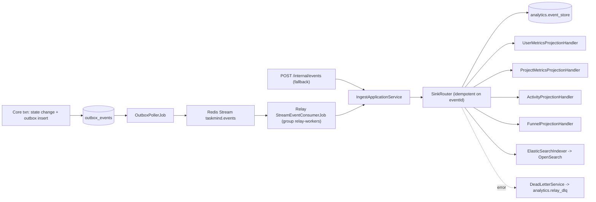

# Reference — Domain Events & Outbox Pipeline

Core ↔ Relay communication is **event-driven** through a transactional outbox and Redis Streams. The envelope and event type catalog live in `libs/events` (`taskmind-events`), shared by Core (publisher) and Relay (consumer).

This reference applies to milestone [M05 — Eventing + Relay](../01-build-order.md#milestone-map) and follows the service boundaries in [00 — Product & Architecture Overview](../00-overview.md#service-boundaries): Core owns business state and outbox publishing; Relay owns analytics projections, read-context projections, and activity search indexing.

## Pipeline

## Semantics

- **Transactional outbox**: Core inserts an `outbox_events` row in the **same transaction** as the business state change. No event is lost if the transaction commits; no event leaks if the transaction rolls back.
- **At-least-once delivery**: the poller publishes to Redis Streams. Relay may see an event more than once, so Relay **deduplicates on `eventId`** via `analytics.relay_processed_events`.
- **Backpressure**: outbox publishing pauses when the stream length exceeds a configured threshold (`taskmind.outbox.backpressure-stream-length`, default `10000`).
- **DLQ**: events that fail projection go to `analytics.relay_dlq`.
- **Transport abstraction**: `libs/events/transport/EventTransport.java` abstracts Redis Streams (active) vs. Kafka (planned).

## Envelope (`DomainEvent`)

`libs/events/.../DomainEvent.java` is a record with these fields:

| Field | Meaning |
|-------|---------|
| `eventId` | UUID; idempotency key |
| `schemaVersion` | envelope schema version |
| `eventType` | canonical type string from the catalog below |
| `occurredAt` | event timestamp |
| `actorUserId` | user who triggered the event |
| `scope` | tenant/scope information |
| `entity` | entity reference: type + id |
| `payload` | event-specific JSON |
| `context` | extra context |

The envelope is validated against `libs/events/.../schema/domain-event-v1.json` via `DomainEventValidator`. JSON ↔ object mapping is handled by `DomainEventMapper`.

## Event type catalog (`EventTypes`)

| Constant group | Strings |
|----------------|---------|
| Task | `task.created`, `task.status_changed`, `task.completed`, `task.archived`, `task.deleted` |
| AI | `ai.capture_submitted`, `ai.suggestion_accepted`, `ai.suggestion_rejected`, `ai.spec_breakdown_completed`, `ai.spec_breakdown_failed` |
| Planner | `planner.daily_generated`, `planner.overflow`, `planner.confirmed` |
| Scheduler | `scheduler.block_completed`, `scheduler.block_missed` |
| Review | `review.weekly_generated`, `review.recommendation_adopted` |

`EventTypeRegistry` enumerates known types for funnel projection.

## Configuration

| Property | Purpose | Default |
|----------|---------|---------|
| `taskmind.outbox.enabled` | enable outbox poller | `true` (local) |
| `taskmind.outbox.backpressure-stream-length` | Redis stream length pause threshold | `10000` |
| `taskmind.relay.stream-key` | Redis stream key | `taskmind.events` |
| `taskmind.relay.consumer-group` | Relay consumer group | `relay-workers` |
| `taskmind.relay.poll-interval-ms` | Relay poll interval | `1000` |
| `taskmind.relay.worker-threads` / `max-in-flight` | Relay concurrency / backpressure | `-` |

## Rebuild guidance

1. Build `libs/events` first: envelope, event type catalog, validator, mapper, transport port, and JSON schema.
2. In Core (M05), add `OutboxEventWriter` to insert outbox rows inside the business transaction, `OutboxPollerJob` to publish rows, `RedisStreamEventTransport`, and task/project domain event publishers.
3. In Relay (M05), add `StreamEventConsumerJob`, `IngestApplicationService`, `SinkRouter`, projection handlers, DLQ handling, and idempotency storage.
