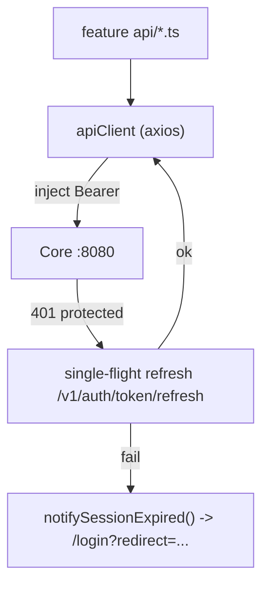

# Reference — Frontend (Vue 3 SPA)

`apps/frontend` is a **Vue 3.5 + Vite 5 + TypeScript 5.8** single-page app. It talks **only to Core** (`apps/backend`, `:8080`) and never to Relay or Nova directly. This reference is the frontend counterpart to the stack, service-boundary, and milestone guidance in [`AGENTS.md`](../../../AGENTS.md), [`00-overview.md`](../00-overview.md), and [`01-build-order.md`](../01-build-order.md).

The frontend is a **separate npm project**. It is not part of the Maven reactor.

## Stack

| Concern | Choice |
|---------|--------|
| Framework / build | Vue 3.5 + Vite 5 + TypeScript 5.8 (`vue-tsc`) |
| UI kit | Ant Design Vue 4 + `@ant-design/icons-vue` |
| State | Pinia 3 |
| Routing | vue-router 4 |
| HTTP | axios, through one shared client |
| Rich text | Tiptap 3, starting from StarterKit, plus custom image/video/autocomplete nodes |
| Forms | vee-validate + yup |
| Dates | dayjs |
| Export | jspdf + jspdf-autotable for reports |

Frontend "lint" is `npm run typecheck` (`vue-tsc --noEmit`) plus `npm run build`. There is no ESLint or unit-test runner specified in the build kit. Use **strict TypeScript**: do not introduce new `any` types; narrow values at API boundaries.

## Directory layout

The target frontend layout is feature-sliced. Keep page components thin, keep server calls in each feature's `api/` folder, and centralize app-wide cross-cutting code under `src/lib/`, `src/stores/`, `src/components/`, and `src/composables/`.

```text
src/
  main.ts                         app bootstrap (Pinia, router, Ant Design Vue)
  App.vue                         shell
  router/index.ts                 routes + nav guards (meta.requiresAuth / meta.public)
  lib/                            cross-cutting infrastructure (HTTP, auth, events)
  stores/                         Pinia stores (auth, projects, assignees, Pinia instance)
  components/                     app-wide shared components
  composables/                    app-wide composables (useTheme, useCurrentUserId, useDebouncedFn)
  features/<feature>/             vertical feature slices
    pages/                        route-level views
    components/                   feature components
    composables/                  reactive logic
    api/                          typed Core HTTP calls
    constants/                    feature-local constants
    types/                        feature-local types
    utils/                        feature-local helpers
    editor/                       feature-local editor helpers/nodes, when needed
```

Reference feature slices:

- `auth`
- `tasks`
- `projects`
- `scheduler`
- `team`
- `reports`
- `ai`
- `specbreakdown`
- `integrations`
- `notifications`
- `landing`

## HTTP layer (`src/lib/`)

All HTTP goes through one axios client. Never instantiate axios elsewhere. Feature APIs call typed helpers that use the shared `apiClient`.

| File | Role |
|------|------|
| `apiClient.ts` | Shared axios instance. Injects bearer tokens. For `401` on a protected route, performs a single-flight refresh via `/v1/auth/token/refresh`, retries once, then emits session-expired behavior. Public auth endpoints are exempt. Base URL comes from `VITE_API_BASE_URL` and defaults to `http://localhost:8080`. |
| `apiError.ts` | Normalizes failed responses to a typed `ApiError`. |
| `authToken.ts` | Access/refresh token storage. |
| `authSession.ts` | `onSessionExpired` / `notifySessionExpired` plumbing. |
| `e2eAuth.ts` | Super-admin bypass helper for local E2E. |
| `taskDataEvents.ts` | Lightweight in-app event bus for task-data refreshes. |



## Auth & routing

- `stores/auth.ts` holds the session and current user, and owns init/login/logout state.
- `router/index.ts` guards routes via `meta.requiresAuth` and `meta.public`.
- `ensureInitialized()` runs before each navigation so guards can make decisions from the current session state.
- Public routes include the landing/home route, `/login`, `/signup`, and `/forgot-password`.
- Session expiry redirects to `/login?redirect=...`.
- Local/test E2E login uses the build-kit bypass credentials: `superadmin@taskmind.local` / password `1` / OTP `1`.

## Stores (Pinia)

| Store | Holds |
|-------|-------|
| `auth.ts` | Session, current user, init/login/logout. |
| `projects.ts` | Project list/cache shared across features. |
| `assignees.ts` | User/assignee lookup cache. |
| `pinia.ts` | Shared Pinia instance for use by guards outside components. |

## Notable feature mechanics

- **Tasks editor** — Tiptap-based block editor with custom image/video node views, media resize, and AI **description autocomplete** inline suggestions.
- **AI** — capture, goal breakdown, weekly review, project brief, translate, and **Nova Chat** through Core facades. Nova chat streams via Core at `/v1/nova/chat/stream`.
- **Notifications** — notification bell plus SSE stream from Core at `/v1/notifications/stream`.
- **Scheduler** — calendar/month layouts and block "why" rationale popovers.
- **Spec breakdown** — spec workspace, source panel, tree nodes, hierarchy merge, and attachments.
- **Reports** — analytics views with PDF export via jspdf.

## Conventions

- Use one HTTP client (`apiClient`) for all requests.
- Keep typed responses per feature under `features/<feature>/api/`.
- Centralize shared enums/constants; do not duplicate status or type strings across components.
- Keep the frontend talking **only to Core**. New server features require a Core facade; never add direct Relay or Nova calls from the SPA.
- Keep page components focused on composition. Put reactive logic in `composables/`, server calls in `api/`, and reusable UI in `components/`.
- Keep `apps/backend/openapi.yaml` synchronized whenever Core request or response shapes change.

## Build & run

Run these from `apps/frontend` unless stated otherwise.

```bash
npm install
npm run dev         # Vite dev server on :5173
npm run typecheck   # vue-tsc --noEmit; required before finishing frontend changes
npm run build       # Vite production build; also type-checks
```

Production uses `npm run build` to produce static SPA assets for S3 + CloudFront. Configure CloudFront/S3 SPA fallback so `403`/`404` route to `/index.html`.

## Rebuild guidance

1. **M03** is the frontend shell milestone: build `apiClient`, refresh flow, router guards, the `auth` store and pages, then task/project pages for a usable browser vertical slice.
2. Add feature slices alongside their Core milestones: scheduler in **M04**, AI in **M08**, spec breakdown in **M09**, integrations in **M10**, notifications in **M11**, and reports/dashboard in **M12**.
3. Gate every UI milestone with `npm run typecheck` and a browser E2E pass on `localhost:5173` using the super-admin bypass.
