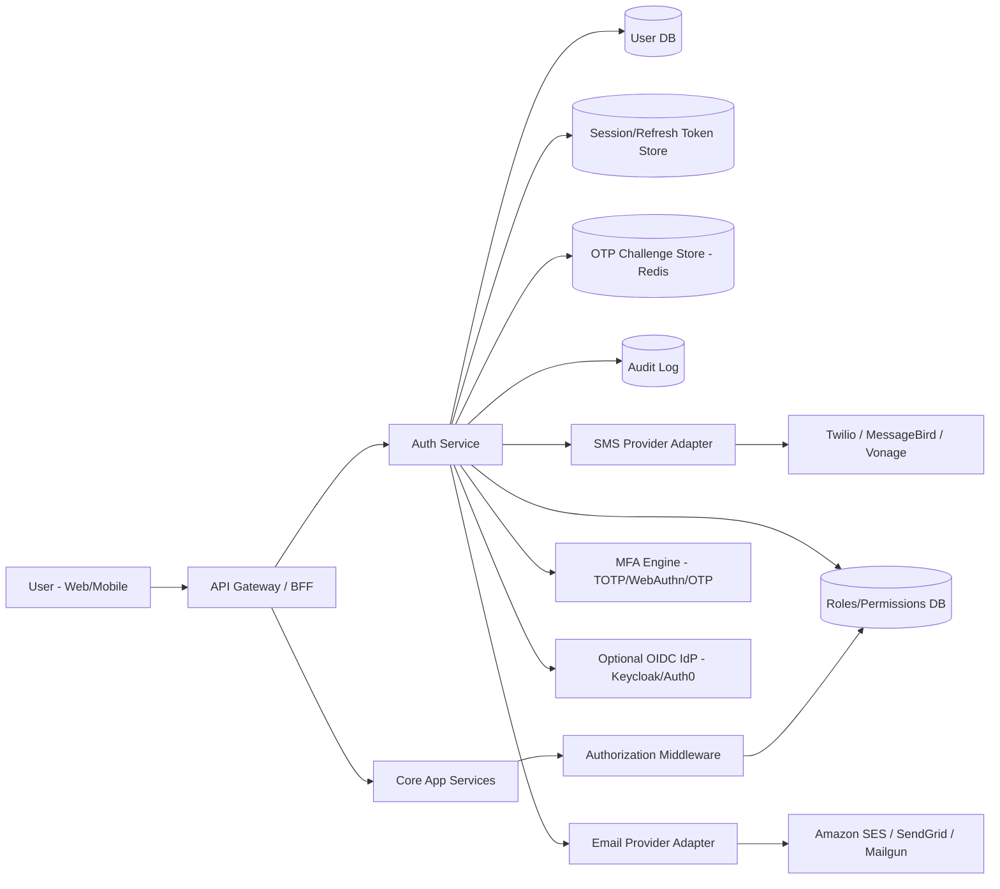

# User Entity + Authentication/Authorization Plan

## 1) System Design (High-Level Diagram)

## 2) Target Capabilities

- User identity supports **email** and **phone** as first-class login identifiers.
- Signup/Sign-in supports either:
  - Email + password + OTP verification, or
  - Phone + OTP passwordless (or phone + password + OTP).
- 2MF (interpreted as 2FA/MFA) required for privileged actions and optionally for all users.
- Strong authorization using RBAC with room for ABAC extension.
- Fully auditable authentication events.

## 3) User Entity Model

### 3.1 Core Tables

1. `users`
   - `id` (UUID, PK)
   - `status` (`PENDING_VERIFICATION`, `ACTIVE`, `LOCKED`, `DISABLED`)
   - `primary_email` (nullable, unique normalized)
   - `primary_phone` (nullable, unique E.164)
   - `password_hash` (nullable for passwordless users)
   - `created_at`, `updated_at`, `last_login_at`

2. `user_identities`
   - `id` (UUID, PK)
   - `user_id` (FK users)
   - `type` (`EMAIL`, `PHONE`)
   - `value` (normalized)
   - `is_verified` (bool)
   - `verified_at`
   - unique constraint: (`type`, `value`)

3. `mfa_methods`
   - `id` (UUID, PK)
   - `user_id` (FK users)
   - `method_type` (`TOTP`, `SMS_OTP`, `EMAIL_OTP`, `WEBAUTHN`)
   - `secret_encrypted` (nullable; for TOTP)
   - `device_metadata` (jsonb)
   - `is_primary` (bool)
   - `enabled` (bool)

4. `roles`, `permissions`, `user_roles`, `role_permissions`
   - Standard RBAC mapping.

5. `sessions`
   - `id` (UUID)
   - `user_id`
   - `refresh_token_hash`
   - `device_info`, `ip`, `expires_at`, `revoked_at`

6. `otp_challenges`
   - `id` (UUID)
   - `user_id` (nullable for pre-user signup)
   - `channel` (`EMAIL`, `SMS`)
   - `destination`
   - `otp_hash`
   - `attempt_count`
   - `expires_at`, `consumed_at`

## 4) Authentication Flows

### 4.1 Sign-Up (Email)
1. Submit email + password.
2. Create user in `PENDING_VERIFICATION`.
3. Send email OTP / verification link.
4. Verify OTP/link.
5. Activate user, optionally require MFA setup before first session.

### 4.2 Sign-Up (Phone)
1. Submit phone.
2. Send SMS OTP.
3. Verify OTP.
4. Create/activate user (with optional password set step).

### 4.3 Sign-In (Email/Phone)
1. User enters email or phone.
2. Resolve identity in `user_identities`.
3. First factor check:
   - password OR passwordless OTP depending on policy.
4. Second factor (2MF): TOTP/WebAuthn/SMS OTP.
5. Issue access token + refresh token and persist session.

### 4.4 Token Strategy
- Access token: JWT (5-15 minutes).
- Refresh token: opaque, rotated every refresh.
- Store only refresh token hash server-side.
- Revoke chain on suspected compromise.

## 5) Authorization Design

### 5.1 Recommended Approach
- Start with RBAC:
  - `USER`, `MANAGER`, `ADMIN`, `SUPER_ADMIN`.
- Add permission granularity:
  - `task.read`, `task.write`, `team.manage`, `user.invite`, etc.
- Middleware checks token claims + permission service lookup (with short cache).

### 5.2 Future ABAC Extensions
- Add context policies (owner, org, project scope).
- Example: `task.write` allowed only when `task.owner_id == user.id` unless role is manager.

## 6) 2MF / MFA Policy

### 6.1 Baseline Policy
- Enforce MFA for admins/managers from day one.
- Optional for regular users initially, then progressive rollout.

### 6.2 Preferred Factors Priority
1. WebAuthn (best phishing resistance)
2. TOTP app
3. SMS OTP (fallback only)
4. Email OTP (recovery/fallback)

### 6.3 Recovery
- One-time recovery codes at MFA enrollment.
- Admin-assisted recovery flow with strong audit trail.

## 7) Email and Phone OTP Service Proposals

## 7.1 Email Service Options

1. **Amazon SES** (recommended default on AWS)
   - Pros: cost effective, high deliverability, IAM integration.
   - Cons: setup/warmup for new domains.

2. **SendGrid**
   - Pros: fast integration, templates, analytics.
   - Cons: can be more expensive at scale.

3. **Mailgun**
   - Pros: developer friendly APIs, routing.
   - Cons: plan pricing may vary by region/volume.

## 7.2 SMS/Phone OTP Service Options

1. **Twilio** (recommended baseline)
   - Pros: global coverage, mature APIs, Verify product for OTP.
   - Cons: higher cost in some countries.

2. **Vonage**
   - Pros: competitive international routing.
   - Cons: regional deliverability variation.

3. **MessageBird**
   - Pros: omnichannel support.
   - Cons: integration complexity can vary.

## 7.3 Integration Pattern (Important)
Use provider adapters and keep your domain independent:

- `OtpDispatchService` interface:
  - `sendEmailOtp(destination, code, template)`
  - `sendSmsOtp(destination, code)`
- Implement adapters:
  - `SesEmailSender`, `SendGridEmailSender`
  - `TwilioSmsSender`, `VonageSmsSender`
- Add feature flags for runtime provider switch.
- Add fallback: if primary provider fails, retry via secondary provider.

## 8) Security Controls Checklist

- Passwords with Argon2id or BCrypt (strong params).
- OTP TTL 3-5 minutes, max attempts 5.
- Rate limit by IP + identity + device fingerprint.
- Brute force lockout with adaptive cooldown.
- Device/session management endpoint for users.
- Comprehensive audit logs for signup/login/MFA/reset/role changes.
- Encryption at rest for secrets, KMS-backed keys.
- PII masking in logs and observability tools.

## 9) API Surface (Draft)

- `POST /auth/signup/email`
- `POST /auth/signup/phone`
- `POST /auth/verify/email-otp`
- `POST /auth/verify/phone-otp`
- `POST /auth/login`
- `POST /auth/mfa/challenge`
- `POST /auth/mfa/verify`
- `POST /auth/token/refresh`
- `POST /auth/logout`
- `GET /auth/sessions`
- `DELETE /auth/sessions/{id}`
- `GET /auth/me`

## 10) Delivery Roadmap

### Phase 1 (2-3 sprints)
- User entity schema and identity normalization.
- Email + phone signup/signin core flows.
- OTP issuance/verification with one email and one SMS provider.
- JWT + refresh token rotation.
- Basic RBAC middleware.

### Phase 2 (1-2 sprints)
- MFA enrollment and enforcement policies.
- Recovery codes and session management UX.
- Provider fallback and observability dashboards.

### Phase 3 (ongoing)
- WebAuthn support and advanced risk-based auth.
- ABAC policy layer where needed.
- Fraud/scam detection and anomaly scoring.

## 11) Recommended Initial Stack

- Auth service: Spring Boot module (or dedicated microservice if scale requires).
- OTP store/session cache: Redis.
- DB: PostgreSQL.
- Email: Amazon SES (or SendGrid if faster setup needed).
- SMS OTP: Twilio Verify.
- Secrets: AWS KMS / HashiCorp Vault.
- Monitoring: OpenTelemetry + centralized logs.

